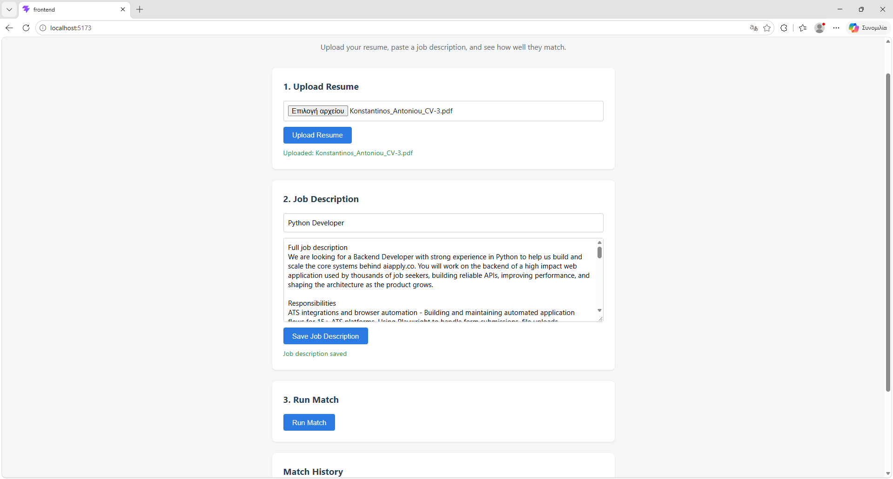
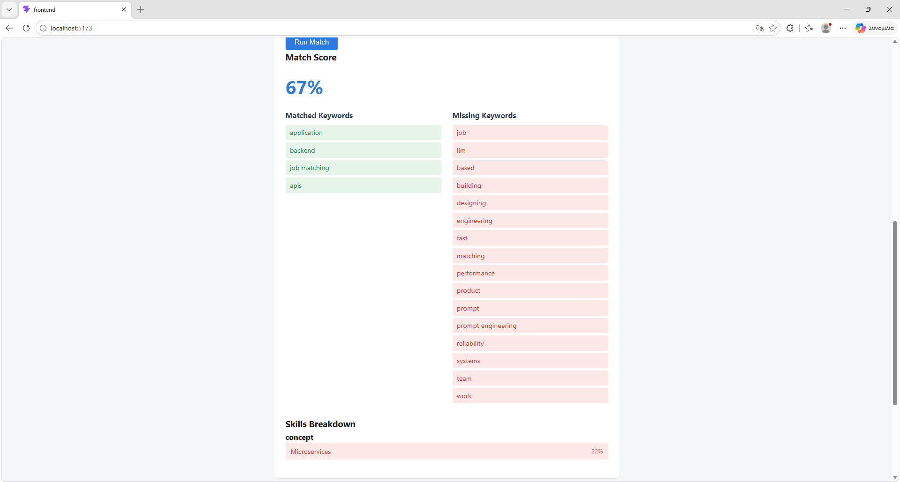
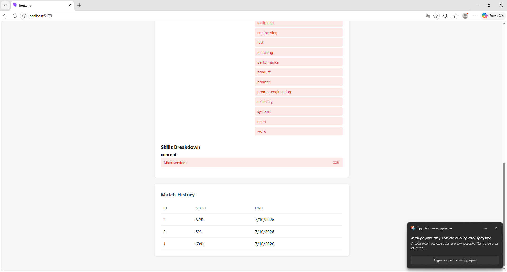

# CV/Resume Matcher

A full-stack web application that analyzes how well a resume matches a job description using NLP, and explains *why* — showing a similarity score, a keyword breakdown, and a skills-gap dashboard highlighting which specific skills are present or missing.

Originally built as a first portfolio project exploring NLP applied to a real-world problem. This is the **v2** version: a significant architectural upgrade from the original (Flask + TF-IDF + vanilla JS), now using semantic embeddings, FastAPI, and a React frontend. The original v1 is preserved as a tag (`v1.0`) in this repo's history.

## Features

- **Upload resumes** in PDF, DOCX, or TXT format
- **Submit job descriptions** as plain text
- **Semantic matching** using sentence embeddings (not just keyword overlap) — recognizes that "led a development team" and "experience managing engineers" describe the same thing, even with no shared words
- **Skills-gap dashboard** — checks the resume against a curated taxonomy of technical and soft skills, showing which skills the job requires, which are present in the resume, and a confidence score for each
- **Match history** stored in a database, viewable at any time
- **REST API** built with FastAPI, with interactive auto-generated documentation
- **React frontend** for a responsive, component-based UI

## Tech Stack

- **Backend:** Python, FastAPI, SQLAlchemy 2.0 (async)
- **NLP / Matching:** sentence-transformers (semantic embeddings), scikit-learn (TF-IDF for candidate keyword extraction)
- **Text extraction:** pdfplumber (PDF), python-docx (DOCX)
- **Database:** SQLite (async via aiosqlite), portable to PostgreSQL
- **Frontend:** React (Vite), vanilla CSS
- **Testing:** pytest, pytest-asyncio, httpx

## How It Works

1. A user uploads a resume and submits a job description.
2. The backend extracts raw text from the uploaded file.
3. Both texts are encoded into dense vector embeddings using a sentence-transformers model, and compared using cosine similarity to produce an overall match score.
4. Candidate keywords are extracted from the job description (via TF-IDF) and compared against the resume using semantic similarity, producing matched/missing keyword lists.
5. Separately, the resume and job description are checked against a curated skills taxonomy (languages, frameworks, databases, tools, concepts, and soft skills). For every skill relevant to the job, the app reports whether it's present in the resume and a confidence score — this is what powers the skills-gap dashboard.
6. Every result is stored in the database, building a searchable match history.

## Screenshots

**Upload a resume and submit a job description**



**Match score and keyword breakdown**



**Skills-gap dashboard and match history**



## Project Structure

```
cv-matcher/
├── app/                        # FastAPI backend
│   ├── main.py                  # App entrypoint, CORS, lifespan
│   ├── database.py               # Async engine/session setup
│   ├── models.py                  # SQLAlchemy 2.0 models
│   ├── schemas.py                  # Pydantic request/response schemas
│   ├── extraction.py                # Text extraction from PDF/DOCX/TXT
│   ├── matching.py                   # Semantic similarity + keyword extraction
│   ├── skills.py                      # Skills-gap matching logic
│   ├── seed.py                         # Seeds the skills taxonomy
│   └── routers/
│       ├── resumes.py
│       ├── jobs.py
│       └── matches.py
├── frontend/                    # React app (Vite)
│   └── src/
│       ├── components/
│       ├── api.js
│       ├── App.jsx
│       └── styles/
├── tests/                        # pytest + pytest-asyncio + httpx
├── instance/                      # SQLite database (gitignored)
├── uploads/                        # Temporary upload storage (gitignored)
├── requirements.txt
└── pytest.ini
```

## API Endpoints

| Method | Endpoint | Description |
|---|---|---|
| POST | `/api/resumes` | Upload and process a resume file |
| GET | `/api/resumes/{id}` | View a stored resume's extracted text |
| POST | `/api/jobs` | Submit a job description |
| GET | `/api/jobs/{id}` | View a stored job description |
| POST | `/api/matches` | Run a match between a resume and a job |
| GET | `/api/matches` | List match history (paginated) |
| GET | `/api/matches/{id}` | Details of a specific match |
| GET | `/api/matches/{id}/skills-gap` | Skills-gap breakdown for a match |

Full interactive documentation is available at `/docs` once the backend is running.

## Setup

### Backend

```bash
cd cv-matcher
python -m venv .venv
source .venv/bin/activate      # Windows: .venv\Scripts\activate
pip install -r requirements.txt

python -m app.seed              # populates the skills taxonomy
uvicorn app.main:app --reload
```

The API will be available at `http://127.0.0.1:8000`, with interactive docs at `http://127.0.0.1:8000/docs`.

### Frontend

In a separate terminal:

```bash
cd cv-matcher/frontend
npm install
npm run dev
```

The app will be available at `http://localhost:5173`.

## Testing

```bash
pytest tests/ -v
```

Covers text extraction, semantic matching logic, skills-gap analysis, and full API integration tests.

## Why This Project

Built to go beyond keyword matching and apply genuinely useful NLP — semantic similarity instead of surface-level text overlap — to a problem every job seeker runs into: understanding how well a resume actually fits a specific role, and what's missing. The v2 rewrite was also an exercise in migrating a working application to a more modern stack (Flask → FastAPI, vanilla JS → React) without breaking what already worked.

## Version History

- **v1** (tag `v1.0`): Flask, TF-IDF + cosine similarity, vanilla JavaScript frontend
- **v2** (current): FastAPI, sentence-transformers embeddings, skills-gap dashboard, React frontend

## Future Improvements

- Expand the skills taxonomy based on real job postings
- Resume improvement suggestions based on missing skills
- Compare one resume against multiple job postings at once
- Deploy a live demo

## License

MIT